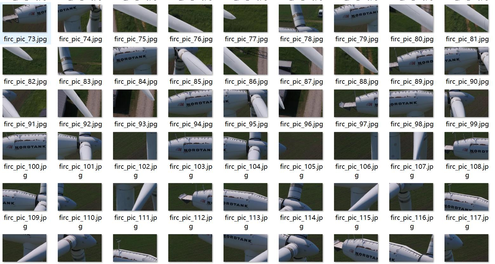
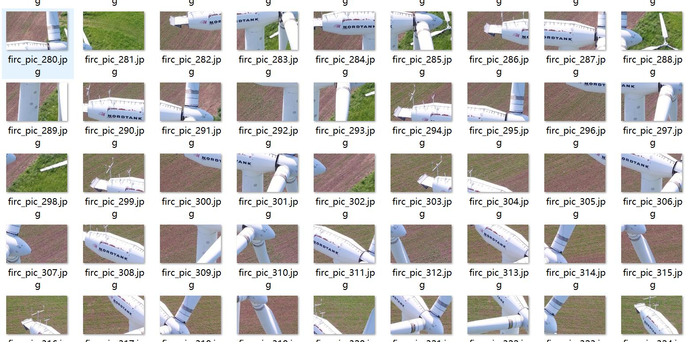
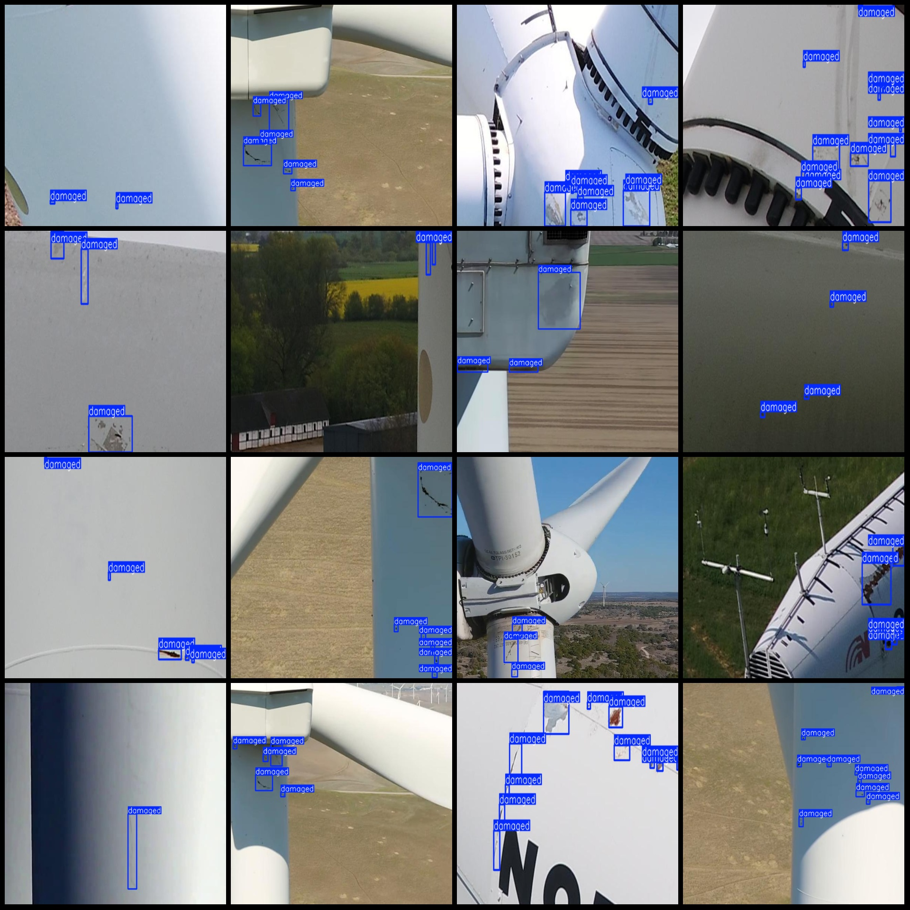
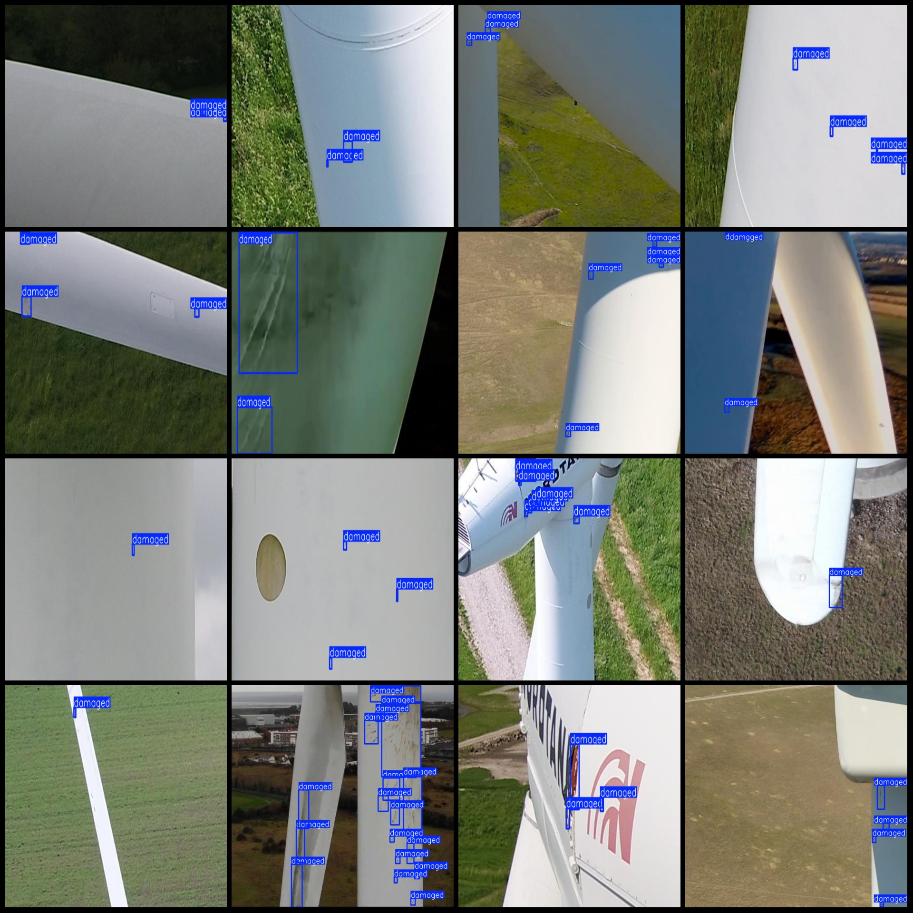

# Drone Perspective Wind Turbine Flaw Detection Dataset (VOC+YOLO) - 5464 Images in 1 Category

The dataset format: Pascal VOC format + YOLO format (txt file without split path, only including jpg images and corresponding VOC format xml files and yolo format txt files).
Number of images (jpg file count): 5464
Number of annotations (xml file count): 5464
Number of annotations (txt file count): 5464
Number of annotation categories: 1
Annotation category name: ["damaged"]
Number of bounding boxes per category:  
Damaged = 23620  
Total bounding box count: 23620  
Number of images per category:  
Damaged = 5464  
Image resolution: 586x371  
Annotation tool used: labelImg  
Annotation rule: draw a rectangular bounding box for the category  
Important note: The dataset does not contain any training, validation, or test split; you must divide it yourself.  
Special statement: This dataset does not guarantee the accuracy of the trained models or weight files.  
Image preview:  
Annotation example:

## Images

Here is a pay link on Stripe ( https://buy.stripe.com/3cs8yP7sY87d0vu9AB ). Please contact me lonlonago@foxmail.com after funding $89, and I will send you a complete data files , thank you!

